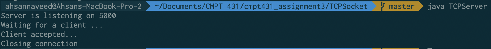
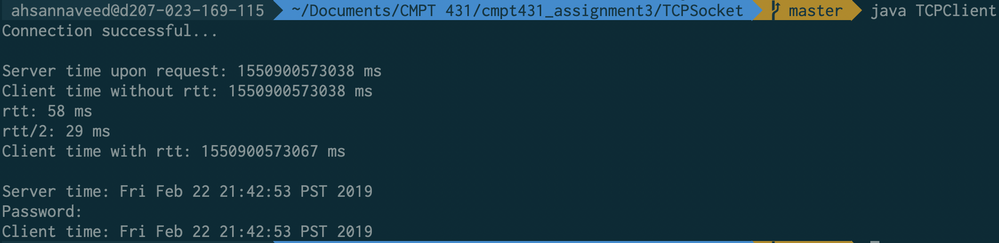

## Summary

Server listens on port 5000. When a client connects, the server sends the current datetime to the client and closes the connection. Client uses server dateTime plus delayTime (computed as per the assignment instructions) to sync its system dateTime with server and closes its connection afterwards.

## Result

1. Server:
   

2. Client (after syncing time with Server time):
   
